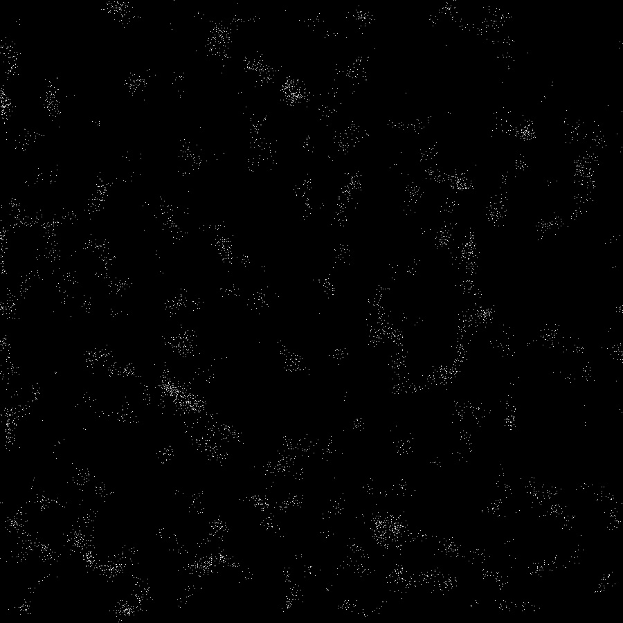

# Vicsek_Model
Example of Vicsek's model for simulating flocks, used in assignments in FFR120 at Chalmers university of technology.
Made in c++ with SDL2, hold 'q' key to quit and then close window.  

